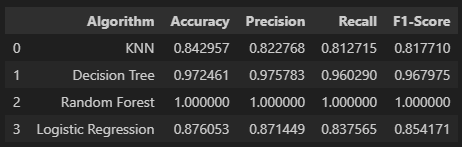
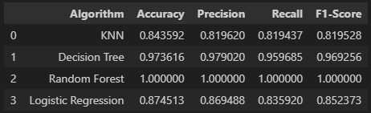
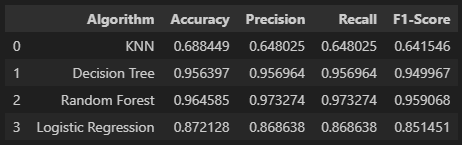
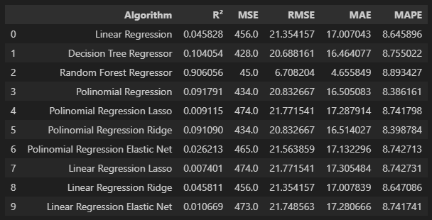
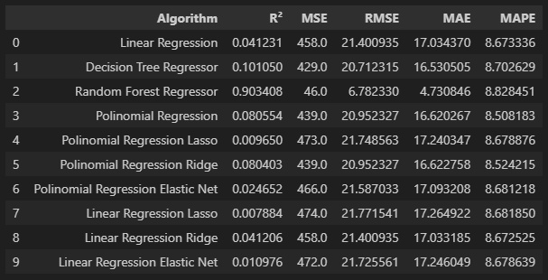
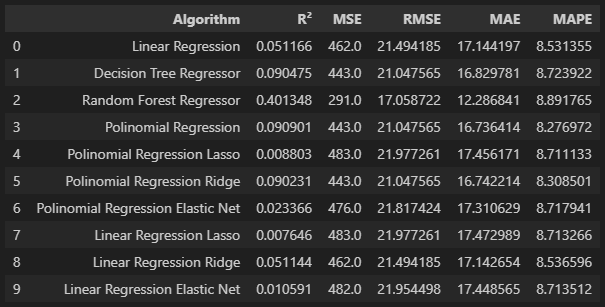
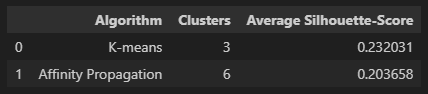

# Nome do Projeto
Ensaio de Machine Learning
# Problema de Negócio
## Descrição
A empresa Data Money acredita que a expertise no treinamento e ajuste fino dos algoritmos, feito pelos Cientistas de Dados da empresa, é o principal motivo dos ótimos resultados que as consultorias vem entregando aos seus clientes.
## Objetivo
O objetivo desse projeto será realizar ensaios com algoritmos de Classificação, Regressão e Clusterização, para estudar a mudança do comportamento da performance, à medida que os valores dos principais parâmetros de controle de overfitting e underfitting mudam. 
# Planejamento da solução
## Produto Final
O produto final será 7 tabelas mostrando a performance dos algoritmos, avaliados usando múltiplas métricas, para 3 conjuntos de dados diferentes: Treinamento, validação e teste.
## Algoritmos ensaiados
### Classificação:
Algoritmos: KNN, Decision Tree, Random Forest e Logistic Regression Métricas de performance: Accuracy, Precision, Recall e F1-Score
### Regressão:
Algoritmos: Linear Regression, Decision Tree Regressor, Random Forest Regressor, Polinomial Regression, Linear Regression Lasso, Linear Regression Ridge, Linear Regression Elastic Net, Polinomial Regression Lasso, Polinomial Regression Ridge e Polinomial Regression Elastic Net Métricas de performance: R2, MSE, RMSE, MAE e MAPE
### Agrupamento:
Algoritmos: K-Means e Affinity Propagation Métricas de performance: Silhouette Score
## Ferramentas utilizadas
Python 3.8 e Scikit-learn
# Desenvolvimento
## Estratégia da solução
Para o objetivo de ensaiar os algoritmos de Machine Learning, eu vou escrever os códigos utilizando a linguagem Python, para treinar cada um dos algoritmos e vou variar seus principais parâmetros de ajuste de overfitting e observar a métrica final. O conjunto de valores que fizerem os algoritmos alcançarem a melhor performance, serão aqueles escolhidos para o treinamento final do algoritmo. 
## O passo a passo
Passo 1: Divisão dos dados em treino, teste e validação. 
Passo 2: Treinamento dos algoritmos com os dados de treinamento, utilizando os parâmetros “default”. 
Passo 3: Medir a performance dos algoritmos treinados com o parâmetro default, utilizando o conjunto de dados de treinamento. 
Passo 4: Medir a performance dos algoritmos treinados com o parâmetro “default”, utilizando o conjunto de dados de validação. 
Passo 5: Alternar os valores dos principais parâmetros que controlam o overfitting do algoritmo até encontrar o conjunto de parâmetros que apresente a melhor performance dos algoritmos. 
Passo 6: Unir os dados de treinamento e validação
Passo 7: Retreinar o algoritmo com a união dos dados de treinamento e validação, utilizando os melhores valores para os parâmetros de controle do algoritmo. 
Passo 8: Medir a performance dos algoritmos treinados com os melhores parâmetros, utilizando o conjunto de dados de teste. 
Passo 9: Avaliar os ensaios e anotar os 3 principais Insights que se destacaram. 
# Os top 3 Insights
## Insight 1
Nos ensaios de Classificação, os algoritmos baseados em árvores (Decision Tree e Random Forest) apresentaram uma melhor performance em todas as métricas, quando aplicados sobre os dados de teste.
## Insight 2
A performance dos algoritmos de classificação sobre os dados de validação ficou bem próxima da performance sobre os dados de teste. 
## Insight 3
Todos os algoritmos de regressão não apresentaram boas métricas de performance, o que mostra uma necessidade de uma seleção de atributos e uma preparação melhor das variáveis independentes do conjunto de dados. 

# Resultados
## Ensaio de Classificação
### Sobre os dados de treinamento

### Sobre os dados de validação

### Sobre os dados de teste

## Ensaio de Regressão
### Sobre os dados de treinamento

### Sobre os dados de validação

### Sobre os dados de teste

## Ensaio de Clusterização

# Conclusões
Nesse ensaio de Machine Learning, consegui adquirir experiência e entender melhor sobre os limites dos algoritmos entre os estados de underffiting e overfitting.
Algoritmos baseados em árvores são sensíveis quanto à profundidade do crescimento e do número de árvores na floresta, fazendo com que a escolha correta dos valores desses parâmetros impeçam os algoritmos de entrar no estado de overfitting. Os algoritmos de regressão, por outro lado, são sensíveis ao grau do polinômio. Esse parâmetro controla o limite entre o estado de underfitting e overfitting desses algoritmos. Já os algoritmos de clusterização podem variar seus desempenhos na definição dos clusters, formando um padrão e número diferentes de clusters dependendo do algoritmo e dos parâmetros utilizados.
Esse ensaio de Machine Learning foi muito importante para aprofundar o entendimento sobre o funcionamento de diversos algoritmos de classificação, regressão e clusterização e quais os principais parâmetros de controle entre os estados de underfitting e overfitting. 

# Próximos passos
Como próximos passos desse ensaio, pretendo ensaiar novos algoritmos de Machine Learning e usar diferentes conjuntos de features para aumentar o conhecimento sobre os algoritmos e quais cenários são mais favoráveis para o aumento da performance dos mesmos.
